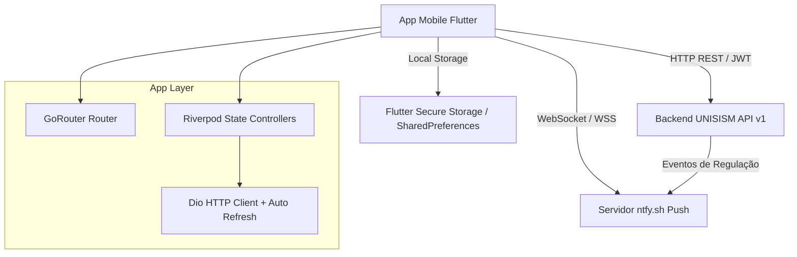

# UNISISM Paciente

Plataforma mobile para acompanhamento de saúde do cidadão, regulação de encaminhamentos, dossiê médico digital, solicitações de Tratamento Fora de Domicílio (TFD) e comunicação com a Secretaria Municipal de Saúde.

---

## 1. Visão Geral

O **UNISISM Paciente** representa a Terceira Face (Cidadão) do ecossistema de gestão de saúde pública UNISISM. Desenvolvido em Flutter, o aplicativo foi projetado para oferecer transparência, autonomia e facilidade de acesso a dados clínicos e administrativos para os pacientes atendidos pela Rede Municipal de Saúde.

### Faces do Ecossistema UNISISM

- **Face 1 (Operacional / UBS):** Interface Svelte para recepção, triagem, consultas médicas e enfermagem nas Unidades Básicas de Saúde.
- **Face 2 (Gestão / Regulação / SMS):** Painéis para a Secretaria Municipal de Saúde e Central de Regulação de exames e consultas especializadas.
- **Face 3 (Cidadão / Paciente - Este aplicativo):** App Flutter mobile iOS/Android para acompanhamento completo da jornada de saúde pelo paciente.

---

## 2. Tecnologias Utilizadas

- **Framework:** Flutter 3.41.x (Dart 3.11+)
- **Gerenciamento de Estado:** Flutter Riverpod 2.6
- **Roteamento e Guardas:** GoRouter 14.6
- **Cliente HTTP:** Dio 5.7 (Interceptadores de autenticação, tratamento de erros e renovação de token)
- **Persistência Segura:** Flutter Secure Storage 9.2 (tokens JWT) e SharedPreferences 2.3 (preferências locais)
- **Arquitetura de Notificações Push:** ntfy.sh via WebSocket Channel + Flutter Local Notifications (Sem vendor lock-in de Firebase/Google Play Services)
- **Formatação de Dados e Validação:** Mask Text Input Formatter, Intl 0.20, Timeago 3.7
- **Tipografia:** Inter (textos gerais) e JetBrains Mono (identificadores estruturados como CPF, CNS e protocolos)

---

## 3. Módulos e Funcionalidades

### 3.1. Central de Comando (Home)
- Painel resumido com cartões de ação rápida.
- Indicador visual do status atual de saúde e próximos compromissos.
- Destaque automático para encaminhamentos pendentes ou agendados.
- Exibição de banners de campanhas de saúde pública emitidos pela Secretaria Municipal de Saúde.

### 3.2. Acompanhamento de Encaminhamentos
- Rastreamento em tempo real de solicitações de exames e consultas especializadas.
- Linha do tempo visual detalhada com histórico de mudanças de status: `solicitado`, `em_regulacao`, `agendado`, `executado`, `cancelado`.
- Classificação por nível de prioridade e urgência (`eletivo`, `urgente`, `prioridade`).
- Visualização de orientações preparatórias pré-exame e anexos de guia de encaminhamento.

### 3.3. Dossiê Médico Digital
- Histórico consolidado de atendimentos realizados na rede municipal.
- Acesso a prescrições médicas e receitas ativas.
- Consulta ao histórico de vacinação com registro de doses e lotes.
- Resultados de exames laboratoriais e de imagem com opção de visualização de laudos.
- Registro de alergias e alertas clínicos relevantes.

### 3.4. Tratamento Fora de Domicílio (TFD)
- Gestão completa de viagens para atendimento especializado em outros municípios.
- Acompanhamento do status de solicitações de TFD (transporte, diárias, hospedagem e passagens).
- Informações sobre itinerário, horário de saída, veículo e dados de contato do motorista responsável.
- Autorização e vinculação de acompanhante.
- Submissão de novas solicitações de TFD diretamente pelo aplicativo com anexos comprobatórios.

### 3.5. Notificações e Comunicação em Tempo Real
- Inbox de mensagens institucionais e alertas de regulação.
- Notificações push em tempo real acionadas por eventos de mudança de status (ex: consulta agendada, viagem confirmada).
- Suporte a deep linking: o toque na notificação abre diretamente a tela do encaminhamento ou viagem correspondente.
- Configuração granular de preferências de notificação (Push, SMS, Email).

### 3.6. Unidade Básica de Saúde (UBS) de Referência
- Consulta de dados da UBS onde o cidadão está cadastrado.
- Informações de horário de funcionamento, equipe de saúde da família responsável e localização.
- Canal de atendimento "Falar com a UBS" para dúvidas e orientações administrativas.

---

## 4. Governança Visual e Design System

O aplicativo utiliza o conceito visual de **Brutalismo Simpático** adaptado para a gestão pública (B2G/B2C), herdando a sobriedade institucional da plataforma UNISISM e aplicando regras específicas de acessibilidade para cidadãos de diversas idades e níveis de letramento digital.

### Regras do Design System

- **Zero bordas arredondadas:** Mantém a identidade estrita de blocos sólidos (`BorderRadius.zero`).
- **Zero sombras difusas:** Utiliza bordas nítidas de alto contraste (`slate-200`, `slate-300`) sem sombras com blur.
- **Uso estrito da cor:** Cores vivas são reservadas exclusivamente para estados do sistema:
  - `blue-900` / `blue-950`: Ações primárias institucionais.
  - `emerald-600`: Sucesso, concluído, agendado.
  - `amber-600`: Pendência, em análise, atenção.
  - `red-600`: Alerta, cancelado, urgência.
- **Tipografia Adaptada:**
  - Fonte sans-serif `Inter` para leitura fluida.
  - Fonte monospace `JetBrains Mono` exclusivamente para CPF, Cartão SUS (CNS), códigos de protocolo e datas formatadas.

### Inversão de Densidade para o Paciente

Ao contrário da interface operacional de alta densidade utilizada pelos profissionais da UBS, a interface do paciente aplica as seguintes adaptações:

| Parâmetro | Interface Operacional (UBS) | App do Paciente |
|---|---|---|
| Tamanho de Fonte Mínimo | 10px - 12px (`text-xs`) | 17px (`text-base`) |
| Tipografia Predominante | Monospace | Sans-Serif |
| Densidade por Tela | Alta (Múltiplas tabelas e formulários) | Baixa (Cards grandes, 1 ação principal) |
| Altura de Botões | 32dp - 40dp | 56dp - 60dp |
| Elementos de Ação | Ações simultâneas em tabela | Fluxos lineares passo a passo |

---

## 5. Arquitetura do Sistema e Fluxo de Dados



### Mecanismo de Autenticação e Sessão

1. **Login:** O paciente autentica informando CPF e senha. O backend retorna um `accessToken` (validez curta) e um `refreshToken` (validez longa).
2. **Armazenamento Seguro:** Os tokens são persistidos em memória criptografada via `FlutterSecureStorage`.
3. **Renovação Proativa:** Um agendador em background dispara a renovação do token 5 minutos antes da expiração do `accessToken`.
4. **Tratamento de 401 Unauthorized:** Se o backend retornar status `401`, o sistema intercepta a resposta, cancela o agendador de refresh, limpa as credenciais locais e redireciona o usuário de forma limpa para a tela de login.

---

## 6. Estrutura de Diretórios

```
lib/
├── main.dart                                 Entrypoint, inicialização de push e router
├── core/
│   ├── constants/app_constants.dart          URLs de API, chaves de armazenamento, timeouts
│   ├── errors/api_exception.dart             Tratamento tipado de erros HTTP e exceções
│   ├── router/app_router.dart                Configuração do GoRouter e guarda de autenticação
│   ├── services/push_service.dart            Gerenciador de push ntfy.sh e notificações locais
│   └── theme/                                Tokens visuais (cores, tipografia, espaçamento, tema)
├── data/
│   ├── api/api_client.dart                   Cliente Dio singleton, interceptadores de token e headers
│   ├── models/                               Modelos de dados (Paciente, Encaminhamento, Dossiê, TFD, etc.)
│   └── repositories/
│       ├── *_repository.dart                 Contratos e implementações HTTP
│       └── mock/mock_seed.dart               Massa de dados demonstrativa realista
├── providers/                                Controllers e providers do Riverpod
└── presentation/
    ├── shared/widgets/                       Biblioteca de componentes compartilhados do Design System
    └── features/
        ├── auth/                             Telas de Login, Splash e Recuperação de Senha
        ├── banners/                          Detalhamento de avisos e campanhas de saúde
        ├── dossie/                           Histórico clínico, consultas, exames e vacinas
        ├── encaminhamento/                   Lista, detalhes, anexos e linha do tempo de regulação
        ├── home/                             Central de comando principal
        ├── notificacoes/                     Central de mensagens e alertas
        ├── onboarding/                       Boas-vindas e introdução ao aplicativo
        ├── perfil/                           Dados cadastrais, alteração de senha e preferências
        ├── tfd/                              Solicitação, listagem e acompanhamento de viagens TFD
        ├── ubs/                              Informações da UBS de referência e contato
        └── main_shell.dart                   Estrutura de navegação por abas (Bottom Navigation)
```

---

## 7. Modo de Demonstração (Mock Mode)

O aplicativo conta com um motor de simulação de dados em memória (`USE_MOCK=true`), ativado por padrão durante o desenvolvimento. Isso permite testar e navegar por todas as telas do aplicativo sem dependência de um servidor backend rodando.

### Credenciais de Acesso (Modo Mock)

- **CPF:** `123.456.789-09` (ou qualquer formato de CPF válido)
- **Senha:** `senha123`

### Dados Pré-carregados no Módulo Mock

- **Paciente:** Maria Aparecida da Silva (62 anos, CNS final 4032).
- **Encaminhamentos:** Consulta em Cardiologia (agendada com data e local), Exame de Ecocardiograma (em análise na Regulação).
- **TFD:** Viagens agendadas para centros de especialidade com informações de motorista, horário e veículo.
- **Vacinas:** Registro de doses aplicadas da vacina contra Influenza e COVID-19.

---

## 8. Guia de Instalação e Execução

### Pré-requisitos

- Flutter SDK `3.41.x` ou superior
- Dart SDK `3.11.x` ou superior
- Xcode (para compilação iOS) ou Android Studio (para compilação Android)

### Passos para Execução

1. Clonar o repositório:
```bash
git clone https://github.com/mateussantanaDev/UNISISM-Paciente.git
cd UNISISM-Paciente
```

2. Instalar as dependências do projeto:
```bash
flutter pub get
```

3. Gerar arquivos de serialização e providers (caso modificado):
```bash
dart run build_runner build --delete-conflicting-outputs
```

4. Executar em modo Mock (Desenvolvimento Standalone):
```bash
flutter run
```

5. Executar conectado ao Backend Real:
```bash
flutter run --dart-define=USE_MOCK=false \
            --dart-define=API_BASE_URL=https://api.unisism.muni.gov.br/v1
```

---

## 9. Comandos de Manutenção e Qualidade

- **Análise Estática de Código (Linter):**
```bash
flutter analyze
```

- **Execução de Suíte de Testes:**
```bash
flutter test
```

- **Geração de Build de Produção (Android APK):**
```bash
flutter build apk --release
```

- **Geração de Build de Produção (iOS):**
```bash
flutter build ios --release
```

---

## 10. Contrato de Comunicação Backend (Endpoints Principais)

A especificação completa das APIs consumidas pelo aplicativo encontra-se detalhada no arquivo `BACKEND_API_PACIENTE.md`. Abaixo estão representados os módulos principais:

- `POST /api/v1/auth/paciente/login` - Autenticação por CPF e senha.
- `POST /api/v1/auth/paciente/refresh` - Renovação de token de acesso.
- `GET  /api/v1/encaminhamentos` - Listagem de encaminhamentos do paciente autenticado.
- `GET  /api/v1/dossie` - Resumo do histórico clínico e prontuário.
- `GET  /api/v1/tfd/solicitacoes` - Listagem e acompanhamento de solicitações de TFD.
- `POST /api/v1/tfd/solicitacoes` - Envio de nova solicitação de TFD.
- `GET  /api/v1/banners` - Campanhas ativas da Secretaria de Saúde.
- `POST /api/v1/dispositivo/registrar` - Registro do token de notificação do aparelho.

---

## 11. Roadmap de Evolução

- **Biometria e Integração com gov.br:** Autenticação simplificada via reconhecimento facial ou digital.
- **Arquitetura Offline-First:** Suporte a cache local persistente com sincronização background para áreas com baixa cobertura de dados.
- **Lembretes de Medicação:** Módulo de gerenciamento de horários para tomada de remédios contínuos prescritos na UBS.
- **Emissão de Segunda Via de Receita:** Solicitação simplificada de renovação de receitas de uso contínuo.
- **Suporte Avançado a Leitores de Tela:** Melhoria contínua de rotulagem semântica (TalkBack e VoiceOver).

---

## 12. Governança e Licença

Este software é parte integrante da suíte de sistemas de saúde pública UNISISM. Desenvolvimento e manutenção sob responsabilidade da Secretaria Municipal de Saúde e equipes de tecnologia autorizadas.
